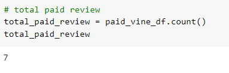
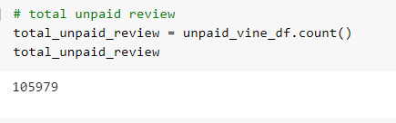
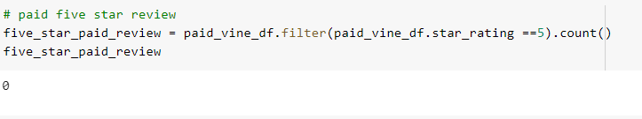
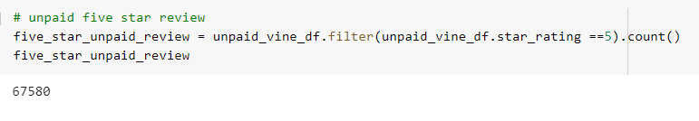
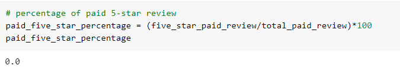
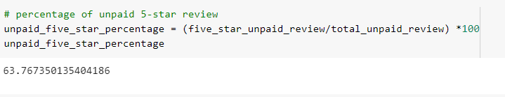

# Amazon_Vine_Analysis

## Overview of the analysis

- The project aims to provide more information to analyze the Amazon reviews from members of paid Amazon Vine program. 

## Results

- Number of Vine reviews

- Number of non-Vine reviews

- Number of 5 stars Vine reviews

- Number of 5 stars non-Vine reviews

- Percentage of 5 stars Vine reviews

- Percentage of 5 stars non-Vine reviews

## Summary 

- Positivity Bias: It can be seen from the dataFrame that there is a huge gap between Vine and non-Vine reviews. In this datasets, there is 0$ of Vine-members provide a 5 stars review. However, to undestand what causes this situation, we need to do more analyzing about it. 
- Additional Analysis: we should consider other criteria in the dataFrame such as 'verified_purchased' or 'helpful_votes' which is lower than 50%. 
